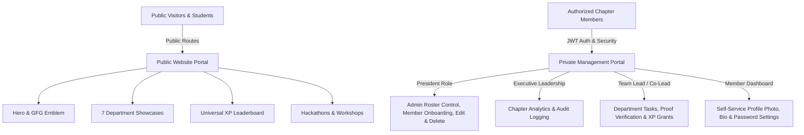

<div align="center">

  <a href="https://gfg-student-chapter.vercel.app" target="_blank">
    
  </a>

  # 🚀 GeeksforGeeks Student Chapter — NIET
  ### *Official Community Website & Enterprise Management Portal*

  [](https://gfg-student-chapter.vercel.app)
  [](https://www.linkedin.com/in/ashutosh-kumar-92612b236)
  [](https://reactjs.org/)
  [](https://vitejs.dev/)
  [](https://tailwindcss.com/)
  [](https://nodejs.org/)

  <p align="center">
    <b>Official Portal for Noida Institute of Engineering and Technology (NIET)</b><br />
    Featuring permanent data retention, custom password security, and an executive management dashboard.
  </p>

  [🌐 Live Production Website](https://gfg-student-chapter.vercel.app) • [👨‍💻 Creator Profile](https://www.linkedin.com/in/ashutosh-kumar-92612b236) • [📖 API Specifications](#-api-specifications)

</div>

---

## 👨‍💻 Lead Architect & Engineer

<div align="center">
  
  ### **Ashutosh Kumar**
  *Lead Full-Stack Engineer, Database Architect & UI/UX Designer*

  [](https://www.linkedin.com/in/ashutosh-kumar-92612b236)
  [](https://github.com/Ashutosh2245)

</div>

---

## 💾 Permanent Data Persistence Engine (`dataStore.json`)

All administrative edits, profile updates, member onboardings, avatar changes, task creations, and password resets **are automatically saved to a persistent JSON store (`backend/db/dataStore.json`)**.

- ✅ **Permanent Retention**: Changes are saved immediately and persist across browser refreshes, server restarts, and redeployments.
- ✅ **Bcrypt Password Security**: Passwords can be changed by members anytime via `/dashboard/profile` or overridden by the President via `/admin/members`.

---

## 🔑 Account Authentication & Custom Passwords

Public registration is disabled for chapter security. Accounts are created by the President, and passwords can be updated freely:

1. **Self-Service Password Change**: Logged-in members can change their password under **[My Profile & Settings](https://gfg-student-chapter.vercel.app/dashboard/profile)**.
2. **President Admin Password Override**: The Chapter President can force-update any member's password from **[Member Management](https://gfg-student-chapter.vercel.app/admin/members)**.
3. **Email Password Reset (`/forgot-password`)**: Members can request a 6-digit security reset code via email to set a new password anytime.

---

## 🛠️ Complete Technology Stack

<div align="center">

### **Frontend & UI Engineering**
<p align="center">
   &nbsp;&nbsp;&nbsp;&nbsp;
   &nbsp;&nbsp;&nbsp;&nbsp;
   &nbsp;&nbsp;&nbsp;&nbsp;
   &nbsp;&nbsp;&nbsp;&nbsp;
   &nbsp;&nbsp;&nbsp;&nbsp;
  
</p>

### **Backend, Database & Cloud Infrastructure**
<p align="center">
   &nbsp;&nbsp;&nbsp;&nbsp;
   &nbsp;&nbsp;&nbsp;&nbsp;
   &nbsp;&nbsp;&nbsp;&nbsp;
   &nbsp;&nbsp;&nbsp;&nbsp;
   &nbsp;&nbsp;&nbsp;&nbsp;
  
</p>

</div>

---

## ⚡ System Architecture



---

## 🏛️ 7 Core Operational Departments

| Icon | Department Name | Key Deliverables & Focus |
| :---: | :--- | :--- |
| 💻 | **Technical Team** | Full-stack web apps, system architecture, open-source projects, competitive programming. |
| 📱 | **Social Media Team** | Digital strategy, Instagram Reels video editing, LinkedIn posts, engagement analytics. |
| 🎪 | **Event Management** | 24-hour hackathons, auditorium logistics, speaker scheduling, student registration desks. |
| 🎨 | **Design Team** | UI/UX design systems, Figma wireframes, hackathon poster art, merchandise branding. |
| 📝 | **Content & Research** | GeeksforGeeks technical blogs, newsletters, API specifications, documentation. |
| 🎬 | **Photography & Video** | Cinematography, event aftermovies, Premiere Pro editing, motion graphics animations. |
| 🤝 | **PR & Outreach** | Corporate sponsorships, inter-college alliances, industry guest speaker relations. |

---

## 🔑 Role Accounts & Password Control

| Role | Email Address | Custom Password Controls |
| :--- | :--- | :--- |
| **👑 President** | `president@gfgniet.ac.in` | Full Admin Control, Edit/Delete Members, Force Reset Password |
| **💻 Tech Lead** | `lead.tech@gfgniet.ac.in` | Task Creation, Code Review, Self Password Edit |
| **⚡ Tech Co-Lead** | `colead.tech1@gfgniet.ac.in` | Deliverable Submissions, Self Profile & Password Edit |
| **🎨 Design Lead** | `lead.design@gfgniet.ac.in` | Design Task Creation, Proof Review, Self Password Edit |

---

## 📡 API Specifications

| Method | Endpoint | Authorization | Description |
| :--- | :--- | :--- | :--- |
| `POST` | `/api/auth/login` | Public | Authenticate member credentials & receive JWT token |
| `POST` | `/api/auth/forgot-password` | Public | Request 6-digit email password reset token |
| `POST` | `/api/auth/reset-password` | Public | Verify code & update portal password |
| `GET` | `/api/users` | Public | Retrieve chapter member roster with filters |
| `PUT` | `/api/users/:id` | President | Full administrative profile edit & password reset |
| `DELETE`| `/api/users/:id` | President | Permanent member account deletion |
| `PATCH`| `/api/users/profile/update`| Auth Member| Self-service profile, avatar photo & password update |
| `GET` | `/api/tasks` | Auth Member| Fetch assigned department tasks |
| `POST` | `/api/tasks/:id/submit` | Co-Lead | Submit deliverable proof (GitHub / Google Drive) |
| `GET` | `/api/leaderboard` | Public | Fetch real-time XP rankings |

---

## 💻 Local Setup & Installation

```bash
# 1. Clone repository
git clone https://github.com/Ashutosh2245/gfg-student-chapter.git
cd gfg-student-chapter

# 2. Start Backend API Server
cd backend
npm install
node server.js
# Backend listening on http://localhost:5000 (Data saves to dataStore.json)

# 3. Start Frontend Dev Server
cd ../frontend
npm install
npm run dev
# Frontend running live on http://localhost:3000
```

---

<div align="center">

  <p>Engineered & Designed with ❤️ by <a href="https://www.linkedin.com/in/ashutosh-kumar-92612b236"><b>Ashutosh Kumar</b></a></p>
  <p>© 2026 GeeksforGeeks Student Chapter NIET. All Rights Reserved.</p>

</div>
