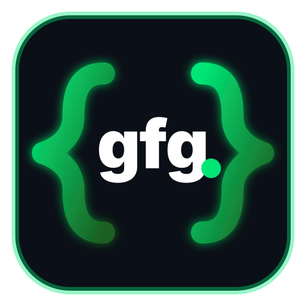
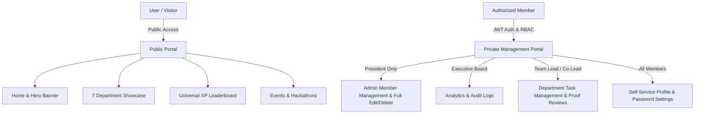

<div align="center">

  

  # 🚀 GeeksforGeeks Student Chapter — NIET
  ### *Official Portal & Enterprise Management System*

  [](https://gfg-student-chapter.vercel.app)
  [](https://reactjs.org/)
  [](https://vitejs.dev/)
  [](https://tailwindcss.com/)
  [](https://nodejs.org/)
  [](./LICENSE)

  <p align="center">
    <b>Architected for Noida Institute of Engineering and Technology (NIET)</b><br />
    A dual-system ecosystem featuring a high-performance public community portal and an internal Role-Based Access Control (RBAC) management portal.
  </p>

  [🌐 Live Demo Website](https://gfg-student-chapter.vercel.app) • [📖 API Documentation](#-api-endpoints) • [🚀 Quick Start](#-quick-start)

</div>

---

## ⚡ System Architecture

The portal operates on **Two Strictly Separated Systems**:



### 1. 🌐 Public Community Portal (Unrestricted Access)
- **Interactive Home & Hero**: Dynamic statistics, high-impact branding, and upcoming hackathon banners.
- **7 Department Explorer**: Detailed overview of core focus areas, active leads, and team rosters.
- **Universal XP Leaderboard**: Live meritocracy rankings calculated across completed tasks and peer reviews.
- **Event Hub**: Showcase of upcoming hackathons, summer bootcamps, and RSVP links.

### 2. 🔒 Private Management Portal (RBAC Protected)
- **Zero Public Registration**: Accounts are exclusively generated by the Chapter President.
- **Multi-Role Security Hierarchy**:
  - `PRESIDENT`: Full administrative authority, onboard members, force-edit profiles, delete accounts, view audit logs.
  - `VICE_PRESIDENT` & `COORDINATOR`: Cross-department oversight, analytics access, executive governance.
  - `LEAD` (Team Leads): Department-scoped task creation, submission reviews, and XP awards.
  - `CO_LEAD` (Co-Leads): Task workspace, deliverable proof submission (GitHub/Drive/Links), and profile management.

---

## 🏢 7 Core Operational Departments

| Department Icon | Department Name | Focus Area & Capabilities |
| :---: | :--- | :--- |
| 💻 | **Technical Team** | Full-stack web applications, competitive programming mentorship, system architecture. |
| 📲 | **Social Media Team** | Digital strategy, Instagram Reels production, campaign analytics, outreach growth. |
| 🎪 | **Event Management** | 24-hour flagship hackathons, venue logistics, auditorium AV setup, check-in desks. |
| 🎨 | **Design Team** | UI/UX design systems, Figma prototypes, event posters, vector merchandise art. |
| 📝 | **Content & Research** | GeeksforGeeks technical blog articles, newsletters, API specs, research papers. |
| 🎬 | **Photography & Video** | Cinematography, event recap aftermovies, Premiere Pro/After Effects motion graphics. |
| 🤝 | **PR & Outreach** | Corporate sponsorships, inter-college alliances, industry guest speaker relations. |

---

## 🔥 Key Technical Highlights

### 🛡️ Smart Avatar Normalizer (`formatAvatarUrl`)
Handles full Windows disk paths (`C:\Users\...`), missing quotes, spaces in filenames (`WhatsApp Image...jpeg`), and URLs dynamically:
```javascript
// Automatically converts raw Windows inputs into web-safe public paths
formatAvatarUrl('""C:\\Users\\...\\public\\avatars\\my photo.jpg""')
// ➔ '/avatars/my%20photo.jpg'
```

### 🔑 Self-Service & Email Password Reset (`/forgot-password`)
- 6-digit security token generation for forgotten credentials.
- Bcrypt password hashing ($10$ rounds) for enterprise security.

### ⚡ Vercel Serverless Monorepo Integration
- Single-repository deployment running Vite React SPA and Express Serverless API functions natively under `/api/*`.

---

## 🛠️ Tech Stack & Dependencies

```
GFG Student Chapter NIET
├── Frontend: React 18, Vite 5, Tailwind CSS, Framer Motion, Lucide React, Axios
├── Backend:  Node.js, Express, JSON Web Tokens (JWT), BcryptJS, PostgreSQL Adapter
└── Infra:    Vercel Serverless Functions, Git, GitHub Actions
```

---

## 🔑 Demo Access Credentials

| Role | Email Address | Password | Permissions |
| :--- | :--- | :--- | :--- |
| **👑 President** | `president@gfgniet.ac.in` | `gfgniet2026` | Full Admin Control, User Edit/Delete, Audit Logs |
| **💻 Tech Lead** | `lead.tech@gfgniet.ac.in` | `gfgniet2026` | Technical Task Creation & Code Review |
| **⚡ Tech Co-Lead** | `colead.tech1@gfgniet.ac.in` | `gfgniet2026` | Task Submissions, Self Profile Edit |
| **🎨 Design Lead** | `lead.design@gfgniet.ac.in` | `gfgniet2026` | Design Task Creation & Deliverable Review |

---

## 🚀 Quick Start (Local Setup)

### Prerequisites
- **Node.js**: `v18.0.0` or higher
- **npm**: `v9.0.0` or higher

### 1. Clone Repository
```bash
git clone https://github.com/Ashutosh2245/gfg-student-chapter.git
cd gfg-student-chapter
```

### 2. Start Backend API Server
```bash
cd backend
npm install
node server.js
# Backend running on http://localhost:5000
```

### 3. Start Frontend Vite Dev Server
```bash
cd ../frontend
npm install
npm run dev
# Frontend live on http://localhost:3000
```

---

## 📡 API Endpoints Spec

| Method | Endpoint | Access | Purpose |
| :--- | :--- | :--- | :--- |
| `POST` | `/api/auth/login` | Public | Authenticate member & generate JWT |
| `POST` | `/api/auth/forgot-password` | Public | Generate 6-digit password reset code |
| `POST` | `/api/auth/reset-password` | Public | Verify code & update password |
| `GET` | `/api/users` | Public | Fetch chapter roster & filtering |
| `PUT` | `/api/users/:id` | President | Full admin profile edit & password reset |
| `DELETE`| `/api/users/:id` | President | Permanent account deletion |
| `PATCH`| `/api/users/profile/update`| Auth User| Self-service profile & photo update |
| `GET` | `/api/tasks` | Auth User| Department & member assigned tasks |
| `POST` | `/api/tasks/:id/submit` | Co-Lead | Submit proof link (GitHub/Drive) |
| `GET` | `/api/leaderboard` | Public | Universal XP standings |

---

## 🌐 Deploy to Vercel in 1-Click

Push changes to GitHub and deploy with Vercel CLI:

```bash
npx vercel --prod
```

Or connect the repository `Ashutosh2245/gfg-student-chapter` on [Vercel Dashboard](https://vercel.com/new).

---

<div align="center">
  <p>Designed & Engineered with ❤️ for the <b>GeeksforGeeks NIET Student Chapter</b></p>
  <p>© 2026 GFG NIET. All Rights Reserved.</p>
</div>
